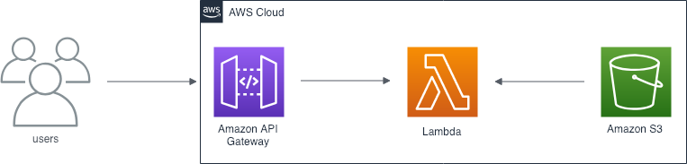

# Terraform Lambda Example 🏗λ
This is a basic Hello World example which will be zipped up and placed in an S3 bucket for a lambda to consume. All the AWS resources will be terraformed together and the zip will be placed in the bucket by Terraform. The Lambda will sit behind an API gateway to allow us to invoke it easily.

 
    

_This below is a high-level view of what is provisioned together_

## Usage
- Run `yarn zip` to archive together the Hello World code
- Run `yarn tf:init` to get aws provider plugin downloaded
- Run `yarn tf:plan` to see changes that will be made
- Run `yarn tf:apply` to actually make those changes to your provider
- Visit AWS and see all your services provisioned via terraform
- Run `yarn tf:destroy` to destroy all the services that were built

You can also simply call `yarn deploy:all` to both zip up an archive and provision the resources together.